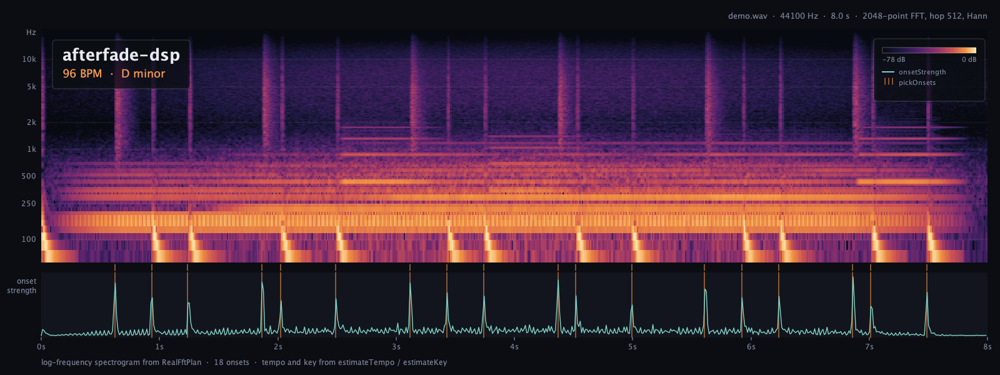

# afterfade-dsp

English | [日本語](README.ja.md)

Pure Kotlin audio DSP for Kotlin Multiplatform. Zero dependencies, `commonMain` only, the same
tests pass on Android, iOS, the JVM and the browser (Wasm).



*Everything in this picture was made by the library: the audio ([docs/demo.wav](docs/demo.wav)) is
generated with `Rng`, `butterworth` and `semitoneRatio`, the spectrogram is drawn from `RealFftPlan`,
the ticks are `pickOnsets`, and the caption comes from `estimateTempo` and `estimateKey`.*

> **Extracted unchanged from [Afterfade](https://apps.apple.com/us/app/afterfade/id6800247416)'s
> production audio engine.** Afterfade turns the sounds of your day into a lo-fi track, entirely on
> the device, on iOS and Android today. This library is the part of that engine that is not
> Afterfade-specific. Built for offline processing of a few seconds of audio in shared Kotlin code,
> not for low-latency live effects.

## Try it

**In the browser.** The [playground](samples/playground/) runs the library as Kotlin/Wasm: drop a
WAV to get its tempo, key and pitch, hear it with a tape treatment, or generate ambience from a seed.
Run it locally with `./gradlew -p samples :playground:wasmJsBrowserDevelopmentRun`
(a hosted copy is published with GitHub Pages once the repository is public).

**From the command line.** No code to write; paths are relative to the repository root.

```sh
./gradlew -p samples :cli:run --args="tempo docs/demo.wav"         # about 96 BPM
./gradlew -p samples :cli:run --args="key docs/demo.wav"           # D minor (confidence 0.21)
./gradlew -p samples :cli:run --args="info docs/demo.wav"          # rate, length, rms, centroid, ZCR
./gradlew -p samples :cli:run --args="tape in.wav tape.wav"        # lowpass, warble, saturation, hiss
./gradlew -p samples :cli:run --args="ambience out.wav --seed 7"   # 10 s of wind-like noise
./gradlew -p samples :cli:run --args="plot docs/demo.wav hero.png" # the picture above
```

All commands are listed in [samples/cli/README.md](samples/cli/README.md).

## Why

If you want audio analysis or processing in shared KMP code, the usual options are heavy:

- JVM audio libraries depend on `java.*` and do not compile for Kotlin/Native, so the iOS side is empty.
- Accelerate on iOS plus something else on Android means two implementations, two test suites,
  and floating-point results that differ between platforms.
- Wrapping a C library through cinterop makes the build configuration a project of its own.

This library is the fourth option: plain Kotlin, no `expect`/`actual` anywhere, deterministic
output on every target thanks to a seeded RNG and a self-contained FFT.

## What is in it

| Area | Functions |
| --- | --- |
| Pitch | `yinPitch`, `estimatePitch`, `hzToNote`, `hzToMidi`, `nearestScaleSemitones`, `semitoneRatio` |
| Pitch shifting | `phaseVocoder`, `pitchShift`, `pitchShiftToKey`, `timeStretch` |
| Key | `chroma`, `estimateKey` |
| Onsets / transients | `melFilterbank`, `onsetStrength`, `pickOnsets`, `detectTransients`, `extractBed` |
| Tempo | `estimateTempo`, `estimateTempoFromEnvelope` |
| Features | `rms`, `zeroCrossingRate`, `spectralCentroid` |
| Effects | `tapeWarble`, `vinylNoise`, `softSaturate` |
| Filters | `butterworth`, `butterworthBandpass`, `SosFilters` (fixed Butterworth sections at 44.1 kHz), `sosfilt` |
| FFT | `Radix2Fft`, `RealFftPlan`, `Fft`, `rfftFreq` |
| Resampling | `resample`, `resampleTo` |
| Random | `Rng` (seeded, bit-identical on every platform) |
| Arrays | `hanning`, `linspace`, `median`, `padReflect`, `padEdge`, `clip`, `rint`, `peakNormalized` |
| I/O | `Wav.decode`, `Wav.encodePcm16`, `Wav.encodeFloat32` |

Everything takes a `FloatArray` or `DoubleArray` and returns a new one. Audio is mono; WAV
decoding folds multi-channel files down to mono.

## What you can build with it

Take a few seconds of audio from a microphone or a file, then analyse or transform it in shared
code. The only things outside the library are the way audio gets in (microphone, platform decoder)
and out (playback, drawing, sharing).

| Goal | Parts used | Needed outside the library |
| --- | --- | --- |
| Tuner, vocal practice, a diary of your voice's pitch | `estimatePitch` / `hzToNote` / `nearestScaleSemitones` | streaming microphone input |
| Tempo (BPM) estimation, beat-synced visuals | `estimateTempo` / `onsetStrength` / `pickOnsets` | loading audio (platform decoder for non-WAV) |
| Tape or vinyl treatment for voice memos | `tapeWarble` / `vinylNoise` / `softSaturate` / `Wav` | recording and sharing |
| Waveform and spectrum visualisation | `Fft` / `RealFftPlan` / `hanning` / `rfftFreq` | Canvas drawing |
| Generated ambience, noise, sleep sounds | `Rng` / `sosfilt` / `resample` / `Wav` | playback only, no input |
| Slicing ambient recordings into musical material (Afterfade itself) | `detectTransients` / `pitchShiftToKey` / `extractBed` | a recipe that assembles a track |

### Tuner

Feed microphone buffers of about 2048 samples at 10 to 20 fps and it tracks in real time.

```kotlin
val hz = estimatePitch(buffer, sr) ?: return        // null for silence or too-short input
val (name, octave) = hzToNote(hz)                   // e.g. "A" to 4
val midi = 69.0 + 12.0 * log2(hz / 440.0)
val cents = ((midi - round(midi)) * 100).roundToInt()   // distance from the nearest note
println("$name$octave ${if (cents >= 0) "+" else ""}$cents cents")
```

### Key estimation

Find the key of one recording, then tune another to it. `estimateKey` returns note and scale
strings that `pitchShiftToKey` takes as they are.

```kotlin
val key = estimateKey(reference, sr) ?: return   // null for silence
println("${key.tonic} ${key.scale} (margin ${key.confidence})")
val tuned = pitchShiftToKey(other, sr, key.tonic, key.scale)
```

### Tempo (BPM) estimation

Autocorrelation of the onset strength envelope, with a prior around 120 BPM to settle the
half-time / double-time ambiguity.

```kotlin
val bpm = estimateTempo(y, sr) ?: return            // null for silence or too-short input
println("about ${bpm.roundToInt()} BPM")
```

`estimateTempo(y, sr, minBpm = 70.0, maxBpm = 140.0)` narrows the search when you know the
material. If you already have the envelope — for drawing it, or for `pickOnsets` — pass it to
`estimateTempoFromEnvelope(env, sr)` instead and the expensive half is not redone.

### Tape treatment for a voice memo

Order and amounts are yours to choose. This is one example, deliberately different from
Afterfade's own master chain. The `SosFilters` coefficients are designed for 44.1 kHz; for any
other rate, design the filter yourself with `butterworth(4, 12000.0, sr)`.

```kotlin
val audio = Wav.decode(bytes)
val sr = audio.sampleRate
var y = sosfilt(SosFilters.LOWPASS_12000_HZ, audio.samples)   // high cut
y = tapeWarble(y, sr, depth = 0.003, rateHz = 0.4)            // wow and flutter
y = softSaturate(y, drive = 0.3)                              // gentle saturation
val hiss = vinylNoise(y.size, sr, amplitude = 0.004)          // hiss
for (i in y.indices) y[i] += hiss[i]
val out = Wav.encodePcm16(peakNormalized(y, 0.9f), sr)
```

### Spectrum visualisation

```kotlin
val n = 2048
val window = hanning(n)
val frame = DoubleArray(n) { buffer[it] * window[it] }
val spec = Fft.rfft(frame)                          // n/2 + 1 complex bins
val freqs = rfftFreq(n, sr)                         // frequency of each bin in Hz
val db = DoubleArray(spec.size) { i ->
    10.0 * log10(spec.re[i] * spec.re[i] + spec.im[i] * spec.im[i] + 1e-12)
}
// draw freqs against db on a Canvas
```

### Generated ambience

Sound with no input at all. The RNG is seeded, so the same seed gives the same audio on Android and iOS.

```kotlin
val sr = 44100
val noise = Rng(7L).gaussianNoise(sr * 10, 0.2)     // 10 s of white noise
val bed = sosfilt(SosFilters.LOWPASS_800_HZ, noise) // keep the low end: wind-like
val out = Wav.encodePcm16(peakNormalized(bed, 0.5f), sr)
```

## Targets

`jvm`, `android` (minSdk 24), `iosArm64`, `iosSimulatorArm64`, `iosX64`, `wasmJs` (browser).

## Install

Not on Maven Central yet. Until then, use it as a composite build:

```kotlin
// settings.gradle.kts
includeBuild("../afterfade-dsp")
```

```kotlin
// build.gradle.kts
kotlin {
    sourceSets {
        commonMain.dependencies {
            implementation("io.github.874wokiite:afterfade-dsp:0.1.0")
        }
    }
}
```

## Example

Read a WAV, find the percussive events in it, tune the first one to C major, and write it back out.

```kotlin
import com.afterfade.dsp.detectTransients
import com.afterfade.dsp.estimatePitch
import com.afterfade.dsp.hzToNote
import com.afterfade.dsp.pitchShiftToKey
import com.afterfade.dsp.softSaturate
import com.afterfade.dsp.tapeWarble
import com.afterfade.dsp.io.Wav

fun process(wavBytes: ByteArray): ByteArray {
    val audio = Wav.decode(wavBytes)              // mono FloatArray + sample rate
    val sr = audio.sampleRate

    val events = detectTransients(audio.samples, sr)
    for (e in events) {
        val hz = estimatePitch(e.audio, sr)
        val note = hz?.let { hzToNote(it) }
        println("onset ${e.onsetSec}s, ${e.audio.size} samples, pitch $note")
    }

    val first = events.firstOrNull()?.audio ?: audio.samples
    var out = pitchShiftToKey(first, sr, key = "C", scale = "major")
    out = tapeWarble(out, sr)
    out = softSaturate(out, drive = 0.4)
    return Wav.encodePcm16(out, sr)
}
```

## Limitations

- **Batch only.** Arrays in, arrays out. Short buffers (about 2048 samples) return in a few
  milliseconds, so analysing microphone input at 10 to 20 fps works. A low-latency live effect
  chain does not.
- **Slower than platform FFTs.** A pure Kotlin FFT is an order of magnitude behind vDSP.
- **WAV only.** No MP3 or AAC decoding. Use the platform decoder to get PCM first.
- **Shaped by one product.** Keys are strings (`"C"`, `"major"`), and names such as `extractBed`
  come from Afterfade's own pipeline.
- KDoc mixes English and Japanese.

## Relation to Afterfade

Afterfade turns the sounds of your day into a lo-fi track, entirely on the device. This library is
its DSP layer: the mechanisms. The recipes that make Afterfade sound like Afterfade (chord
templates, drum patterns, the master chain) stay in the app.

The rule for what belongs here: **if passing a different number gives you a different sound, it
is a mechanism and it goes in the library. If the numbers are fixed and it has a name, it is a
recipe and it stays in the app.** `softSaturate(y, drive)` is here; `lofiMaster` is not.

## Development

```sh
./gradlew jvmTest                 # fast, runs on the host JVM
./gradlew iosSimulatorArm64Test   # same tests on the iOS simulator
./gradlew assemble                # compile every target
./gradlew -p samples :cli:installDist                       # the command-line sample
./gradlew -p samples :playground:wasmJsBrowserDistribution  # the browser playground as a static site
```

The samples live in a separate Gradle build under [samples/](samples/) so the library itself stays
dependency-free.

## License

Apache License 2.0. See [LICENSE](LICENSE).
